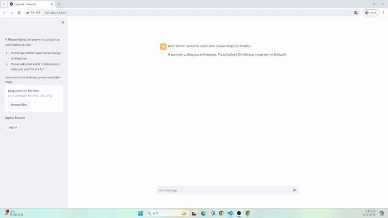
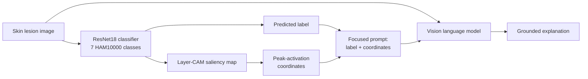

# Explainable Skin Lesion Diagnosis with CAM-Guided Vision Language Models

Research code for my M.S. thesis at Sogang University (Data Science and Artificial Intelligence, 2024):
**"Enhancing Dermatological Diagnostics by Explainable AI and Vision Language Model"**
([thesis record](https://dcollection.sogang.ac.kr/dcollection/srch/srchDetail/000000078907))

The project asks a practical question: if a lesion classifier is trained only on image-level labels, can its explanation map (CAM) be turned into a signal that makes a general-purpose vision language model (VLM) give better, more grounded diagnostic explanations, without any medical fine-tuning of the VLM?



> This is a research and education project. It is not a medical device and must not be used for diagnosis.

## How it works



1. **Classification.** ResNet models are fine-tuned on HAM10000 (7 classes: akiec, bcc, bkl, df, mel, nv, vasc) using image-level labels only.
2. **Explanation.** A CAM method produces a saliency map for the predicted class. The pixel with the highest activation is extracted as a coordinate.
3. **Grounded generation.** The predicted label and the coordinate are inserted into the prompt, so the VLM is asked to reason about a specific region of the image instead of the image as a whole.
4. **Evaluation.** Generated explanations are scored with G-EVAL (LLM-as-judge) on five criteria: accuracy and completeness, interpretability, safety and reliability, adaptability, and sensitivity/specificity.

## Results

**Step 1: Classifier selection** (test accuracy, 8,012 training images; augmentation doubles or quadruples the set)

| Model | Epochs | No augmentation | Random augmentation | Whole augmentation |
|---|---|---|---|---|
| ResNet18 | 10 | 74% | 82% | 84% |
| ResNet18 | 50 | 77% | 85% | 83% |
| **ResNet18** | **100** | 83% | 82% | **85%** |
| ResNet50 | 100 | 80% | 81% | 80% |
| ResNet101 | 100 | 77% | 75% | 79% |

**Step 2: CAM method selection.** Each CAM map was thresholded and compared with lesion segmentation masks (mIoU), to check whether the explanation actually points at the lesion.

| CAM method | Best mIoU | Threshold |
|---|---|---|
| Grad-CAM | 0.5107 | 0.4 |
| Grad-CAM++ | 0.5248 | 0.4 |
| **Layer-CAM** | **0.5287** | **0.4** |
| Eigen-CAM | 0.4021 | 0.1 |

Final configuration: ResNet18, 100 epochs, whole augmentation, Layer-CAM at threshold 0.4.

**Step 3: Effect of CAM coordinates on VLM explanations.** Compared with a control prompt that only asks for a diagnosis, the focused prompt with CAM coordinates improved G-EVAL scores:

| Criterion | Control to CAM-guided prompt |
|---|---|
| Accuracy and completeness | +7.4% |
| Sensitivity and specificity | +4.5% |
| Safety and reliability | +0.8% |

Scores improved further as the coordinates moved closer to the ground-truth lesion center, which suggests the VLM is using the location information rather than ignoring it.

**Limitations.** HAM10000 consists mostly of lighter skin tones, which limits generalization. CAM localization (about 0.53 mIoU) is the main bottleneck; better localization should translate directly into better explanations.

## Repository structure

```
MODEL/
├── FINETUNING_TRANSFER_LEARNING/   # ResNet transfer learning on HAM10000
│   ├── main_train.py               # entry point (--model, --epoch, --augment)
│   ├── transfer_learning.py
│   └── customize_dataset.py
├── LLM/output/                     # G-EVAL scores for control / CAM-guided prompts
└── Streamlit/                      # demo chatbot
    ├── streamlit.py
    ├── pretrained/resnet18_pretrained.pth
    └── utils/                      # inference (Layer-CAM + VLM call), auth, cache
DEMO/
├── SHORT_FORM.gif
├── [DEMO] Skin disease AI Chat bot.mkv
└── model explanation.pdf           # full experiment slides (Korean)
```

## Running the demo

```bash
git clone https://github.com/hyunhp/XAI-ExplainableAI.git
cd XAI-ExplainableAI
pip install -r pip_requirements.txt          # or: conda create --name <env> --file conda_requirements.txt
cd MODEL/Streamlit
```

Create a `.env` file:

```
pretrained_model_path=pretrained/resnet18_pretrained.pth
openai_api_key=YOUR_OPENAI_API_KEY
GPT4_PROMPT=YOUR_PROMPT_TEMPLATE
```

The demo uses a simple login. Generate the credential file once, then start the app:

```bash
python utils/authentication.py    # writes pkl/hashed_pw.pkl
streamlit run streamlit.py        # open http://localhost:8501
```

To retrain the classifier, place HAM10000 images and labels locally, set the path in `env_cam.json`, and run:

```bash
cd MODEL/FINETUNING_TRANSFER_LEARNING
python main_train.py --model resnet18 --epoch 100 --augment whole
```

## Tech stack

PyTorch, torchvision, pytorch-grad-cam, OpenCV, OpenAI vision API, G-EVAL, Streamlit

## Author

Hyunho Park · [LinkedIn](https://www.linkedin.com/in/hyun-ho-park/) · [GitHub](https://github.com/hyunhp)

Original research: 2024. README revised: 2026-09.
